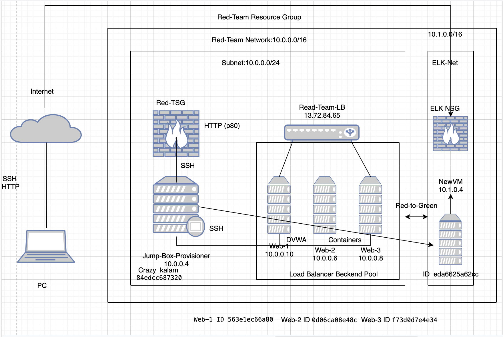
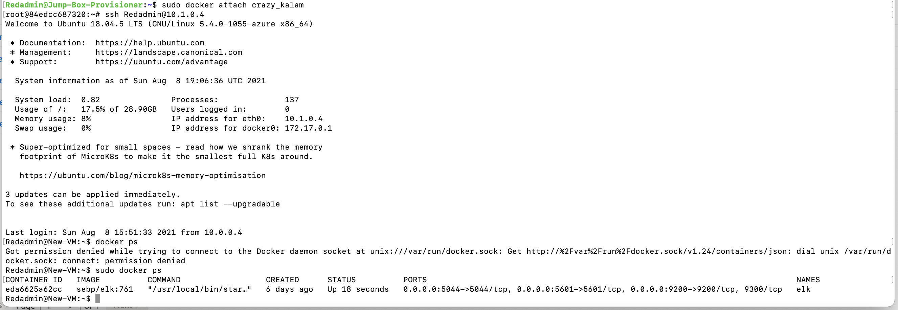

## Automated ELK Stack Deployment

The files in this repository were used to configure the network depicted below.

 

These files have been tested and used to generate a live ELK deployment on Azure. They can be used to either recreate the entire deployment pictured above. Alternatively, select portions of the playbook file may be used to install only certain pieces of it, such as Filebeat.

  -install-elk.yml

This document contains the following details:
- Description of the Topologu
- Access Policies
- ELK Configuration
  - Beats in Use
  - Machines Being Monitored
- How to Use the Ansible Build

### Description of the Topology

The main purpose of this network is to expose a load-balanced and monitored instance of DVWA, the D*mn Vulnerable Web Application.

Load balancing ensures that the application will be highly available, in addition to restricting access to the network.
- _TODO: What aspect of security do load balancers protect? A load balancer defends an organization against distributed denial-of-service (DDoS) attacks. It does this by shifting attack traffic from the corporate server to a public cloud provider.  What is the advantage of a jump box? The advantage of a jump box is to give access to the user from a single node that can be secured and monitored, it also allows you to simplify inbound rules

Integrating an ELK server allows users to easily monitor the vulnerable VMs for changes to the log files  and system metrics.
- What does Filebeat watch for? Log files
- What does Metricbeat record? Performance Metrics

The configuration details of each machine may be found below.
_Note: Use the [Markdown Table Generator](http://www.tablesgenerator.com/markdown_tables) to add/remove values from the table_.

| Name     | Function | IP Address | Operating System |
|----------|----------|------------|------------------|
| Jump Box | Gateway  | 10.0.0.1   | Linux            |
| Web-1    |Webservers| 10.0.0.10  | Linux            |
| Web-2    |Webservers| 10.0.0.6   | Linux            |
| Web-3    |Webservers| 10.0.0.8   | Linux            |
| ELKVM    |Webservers| 10.1.0.4   | Linux            | 
### Access Policies

The machines on the internal network are not exposed to the public Internet. 

Only the Jump-Box-Provisioner machine can accept connections from the Internet. Access to this machine is only allowed from the following IP addresses: 
- My IPv4 

Machines within the network can only be accessed by SSH & Port 22
- Jump-Box-Provisioner: Private IP 10.0.0.4

A summary of the access policies in place can be found in the table below.

| Name     | Publicly Accessible | Allowed IP Addresses |
|----------|---------------------|----------------------|
| Jump Box | Yes/No              |   My IPv4            |
| Web-1    | No                  |   10.0.0.4           |
| Web-2    | No                  |   10.0.0.4           |
| Web-3    | No                  |   10.0.0.4           | 
| ELKVM    | Yes                 |MyIPv4 P5601 10.0.0.4 P22  |
### Elk Configuration

Ansible was used to automate configuration of the ELK machine. No configuration was performed manually, which is advantageous because...
-  Saves resources time/manpower and eliminates human error. What is the main advantage of automating configuration with Ansible? It allows IT administrators to automate away the drudgery from their daily tasks. That frees them to focus on efforts that help deliver more value to the business by spending time on more important tasks

The playbook implements the following tasks:
- Enable docker on boot
- Download and launch a docker elk container
- Installs docker.io python3.pip and docker module
- Increase virtual memory

The following screenshot displays the result of running `docker ps` after successfully configuring the ELK instance.

### Target Machines & Beats
This ELK server is configured to monitor the following machines:
- Web-1 10.0.0.10 
- Web-2 10.0.0.6 
- Web-3 10.0.0.8 

We have installed the following Beats on these machines:
- Filebeat
- Metricbeat

These Beats allow us to collect the following information from each machine:
- It monitors the log files or specified locations, collects log events, and forwards them either to Elastic/ Logsstash for indexing.
- Metricbeat periodically collects metrics from the OS and from services running on the server. 

### Using the Playbook
In order to use the playbook, you will need to have an Ansible control node already configured. Assuming you have such a control node provisioned: 

SSH into the control node and follow the steps below:
- Copy the filebeat-playbook.yml and metricbeat-playbook.yml file to /etc/ansible/roles.
- Update the /etc/ansible/hosts file to include
- [Webserveres]
- 10.0.0.6  ansible_python_interpreter=/usr/bin/python3
- 10.0.0.8  ansible_python_interpreter=/usr/bin/python3
- 10.0.0.10 ansible_python_interpreter=/usr/bin/python3
- [ELK]
- 10.1.0.4 ansible_python_interpreter=/usr/bin/python3
- Run the playbook, and navigate to http://13.77.77.15:5601 /app/kibana to check that the installation worked as expected.

Answer the following questions to fill in the blanks:
- _Which file is the playbook? Where do you copy it? Install-elk.yml it is in the docker container in /etc/ansible
- _Which file do you update to make Ansible run the playbook on a specific machine? /etc/ansible/hosts 
 How do I specify which machine to install the ELK server on versus which to install Filebeat on? They are goupped and listed separately as [Webservers] and [Elk] groups
- _Which URL do you navigate to in order to check that the ELK server is running? http://13.77.77.15:5601 /app/kibana

_As a **Bonus**, provide the specific commands the user will need to run to download the playbook, update the files, etc._

ansible-playbook /etc/ansible/install-elk.yml